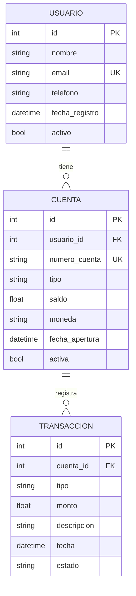

# Documento de Diseño Técnico

## Introducción

Este documento describe el diseño técnico de la aplicación móvil SENTURER, un banco digital de resiliencia implementado en Flutter v3. La aplicación proporciona una experiencia bancaria nativa en dispositivos móviles con persistencia local mediante SQLite, navegación tipo Flyout, y una interfaz moderna centrada en el usuario.

## Visión General

SENTURER es una aplicación bancaria móvil que opera como una entidad tecnológica con licencia bancaria. La aplicación permite a los usuarios gestionar sus cuentas, realizar transacciones y acceder a servicios bancarios digitales sin depender de una conexión constante a internet, gracias a su capa de persistencia local.

### Objetivos del Diseño

- Proporcionar una experiencia de usuario fluida y moderna
- Garantizar la persistencia confiable de datos financieros localmente
- Implementar una arquitectura escalable y mantenible
- Asegurar la navegación intuitiva mediante un menú lateral personalizable
- Optimizar el rendimiento y la respuesta de la aplicación

### Alcance

Este diseño cubre:
- Arquitectura de la aplicación en tres capas (Presentation, Data, Core)
- Sistema de navegación con FlyoutMenu
- Gestión de persistencia con SQLite
- Pantallas principales (SplashScreen, HomePage)
- Modelos de datos y repositorios
- Estrategia de testing

## Arquitectura

### Patrón Arquitectónico

La aplicación sigue una arquitectura en capas con separación clara de responsabilidades:

```
┌─────────────────────────────────────────┐
│         Presentation Layer              │
│  (UI, Widgets, Screens, Navigation)     │
└─────────────────┬───────────────────────┘
                  │
┌─────────────────▼───────────────────────┐
│            Data Layer                   │
│  (Models, Repositories, Data Sources)   │
└─────────────────┬───────────────────────┘
                  │
┌─────────────────▼───────────────────────┐
│            Core Layer                   │
│  (Database, Router, Theme, Constants)   │
└─────────────────────────────────────────┘
```


### Capas de la Arquitectura

#### 1. Presentation Layer (Capa de Presentación)

Responsable de la interfaz de usuario y la interacción con el usuario.

**Componentes:**
- **Screens**: SplashScreen, HomePage, y futuras pantallas
- **Navigation**: FlyoutMenu, FlyoutHeader, FlyoutItem, FlyoutFooter
- **Widgets**: Componentes reutilizables de UI

**Responsabilidades:**
- Renderizar la interfaz de usuario
- Capturar eventos del usuario
- Delegar lógica de negocio a la capa de datos
- Gestionar el estado local de la UI

#### 2. Data Layer (Capa de Datos)

Gestiona el acceso y manipulación de datos.

**Componentes:**
- **Models**: Usuario, Cuenta, Transaccion
- **Repositories**: UsuarioRepository, CuentaRepository, TransaccionRepository

**Responsabilidades:**
- Definir estructuras de datos
- Implementar operaciones CRUD
- Abstraer el acceso a la base de datos
- Transformar datos entre capas

#### 3. Core Layer (Capa Central)

Proporciona funcionalidades compartidas y configuración.

**Componentes:**
- **Database**: DatabaseHelper (singleton), migraciones
- **Router**: AppRouter con rutas nombradas
- **Theme**: AppTheme con colores y estilos
- **Constants**: Strings, colores, rutas de assets

**Responsabilidades:**
- Gestionar la conexión a SQLite
- Centralizar la navegación
- Definir el tema visual
- Proporcionar constantes globales

### Flujo de Datos

```
Usuario → Presentation → Repository → DatabaseHelper → SQLite
                ↓              ↓              ↓
            UI Update ← Model ← Query Result
```


## Componentes e Interfaces

### 1. DatabaseHelper

Singleton que gestiona la conexión y operaciones con SQLite.

```dart
class DatabaseHelper {
  static final DatabaseHelper instance = DatabaseHelper._internal();
  static Database? _database;
  
  DatabaseHelper._internal();
  
  Future<Database> get database async {
    if (_database != null) return _database!;
    _database = await _initDatabase();
    return _database!;
  }
  
  Future<Database> _initDatabase() async;
  Future<void> _onCreate(Database db, int version) async;
  Future<void> _onUpgrade(Database db, int oldVersion, int newVersion) async;
}
```

**Métodos principales:**
- `get database`: Retorna la instancia de la base de datos (lazy initialization)
- `_initDatabase()`: Inicializa la base de datos en el primer acceso
- `_onCreate()`: Crea las tablas en la primera ejecución
- `_onUpgrade()`: Ejecuta migraciones cuando cambia la versión

**Configuración:**
- Nombre de archivo: `senturer_banco.db`
- Versión inicial: 1
- Ubicación: Directorio de documentos de la aplicación

### 2. Modelos de Datos

#### Usuario

```dart
class Usuario {
  final int? id;
  final String nombre;
  final String email;
  final String telefono;
  final DateTime fechaRegistro;
  final bool activo;
  
  Usuario({
    this.id,
    required this.nombre,
    required this.email,
    required this.telefono,
    required this.fechaRegistro,
    this.activo = true,
  });
  
  Map<String, dynamic> toMap();
  factory Usuario.fromMap(Map<String, dynamic> map);
}
```

#### Cuenta

```dart
class Cuenta {
  final int? id;
  final int usuarioId;
  final String numeroCuenta;
  final String tipo; // 'ahorro', 'corriente', 'digital'
  final double saldo;
  final String moneda;
  final DateTime fechaApertura;
  final bool activa;
  
  Cuenta({
    this.id,
    required this.usuarioId,
    required this.numeroCuenta,
    required this.tipo,
    required this.saldo,
    required this.moneda,
    required this.fechaApertura,
    this.activa = true,
  });
  
  Map<String, dynamic> toMap();
  factory Cuenta.fromMap(Map<String, dynamic> map);
}
```

#### Transaccion

```dart
class Transaccion {
  final int? id;
  final int cuentaId;
  final String tipo; // 'deposito', 'retiro', 'transferencia'
  final double monto;
  final String descripcion;
  final DateTime fecha;
  final String estado; // 'pendiente', 'completada', 'fallida'
  
  Transaccion({
    this.id,
    required this.cuentaId,
    required this.tipo,
    required this.monto,
    required this.descripcion,
    required this.fecha,
    this.estado = 'pendiente',
  });
  
  Map<String, dynamic> toMap();
  factory Transaccion.fromMap(Map<String, dynamic> map);
}
```


### 3. Repositorios

Los repositorios abstraen el acceso a datos y proporcionan una API limpia para la capa de presentación.

#### UsuarioRepository

```dart
class UsuarioRepository {
  final DatabaseHelper _dbHelper = DatabaseHelper.instance;
  
  Future<int> insertar(Usuario usuario);
  Future<Usuario?> obtenerPorId(int id);
  Future<Usuario?> obtenerPorEmail(String email);
  Future<List<Usuario>> obtenerTodos();
  Future<int> actualizar(Usuario usuario);
  Future<int> eliminar(int id);
}
```

#### CuentaRepository

```dart
class CuentaRepository {
  final DatabaseHelper _dbHelper = DatabaseHelper.instance;
  
  Future<int> insertar(Cuenta cuenta);
  Future<Cuenta?> obtenerPorId(int id);
  Future<List<Cuenta>> obtenerPorUsuario(int usuarioId);
  Future<Cuenta?> obtenerPorNumeroCuenta(String numeroCuenta);
  Future<int> actualizar(Cuenta cuenta);
  Future<int> eliminar(int id);
  Future<double> obtenerSaldoTotal(int usuarioId);
}
```

#### TransaccionRepository

```dart
class TransaccionRepository {
  final DatabaseHelper _dbHelper = DatabaseHelper.instance;
  
  Future<int> insertar(Transaccion transaccion);
  Future<Transaccion?> obtenerPorId(int id);
  Future<List<Transaccion>> obtenerPorCuenta(int cuentaId, {int? limite});
  Future<List<Transaccion>> obtenerUltimas(int usuarioId, int limite);
  Future<int> actualizar(Transaccion transaccion);
  Future<int> eliminar(int id);
}
```

### 4. Sistema de Navegación

#### AppRouter

Centraliza todas las rutas de la aplicación.

```dart
class AppRouter {
  static const String splash = '/';
  static const String home = '/home';
  static const String cuentas = '/cuentas';
  static const String transferencias = '/transferencias';
  static const String perfil = '/perfil';
  
  static Map<String, WidgetBuilder> getRoutes() {
    return {
      splash: (context) => const SplashScreen(),
      home: (context) => const HomePage(),
      cuentas: (context) => const CuentasPage(),
      transferencias: (context) => const TransferenciasPage(),
      perfil: (context) => const PerfilPage(),
    };
  }
  
  static List<FlyoutItemConfig> getFlyoutItems() {
    return [
      FlyoutItemConfig(
        title: 'Inicio',
        route: home,
        icon: Icons.home,
      ),
      FlyoutItemConfig(
        title: 'Cuentas',
        route: cuentas,
        icon: Icons.account_balance,
        tabs: ['Mis Cuentas', 'Movimientos'],
      ),
      FlyoutItemConfig(
        title: 'Transferencias',
        route: transferencias,
        icon: Icons.swap_horiz,
      ),
      FlyoutItemConfig(
        title: 'Perfil',
        route: perfil,
        icon: Icons.person,
      ),
    ];
  }
}
```


#### FlyoutMenu

Implementa el menú lateral usando el Drawer nativo de Flutter.

```dart
class FlyoutMenu extends StatelessWidget {
  const FlyoutMenu({Key? key}) : super(key: key);
  
  @override
  Widget build(BuildContext context) {
    return Drawer(
      child: Column(
        children: [
          const FlyoutHeader(),
          Expanded(
            child: ListView(
              padding: EdgeInsets.zero,
              children: _buildFlyoutItems(context),
            ),
          ),
          const FlyoutFooter(),
        ],
      ),
    );
  }
  
  List<Widget> _buildFlyoutItems(BuildContext context);
}
```

#### FlyoutHeader

```dart
class FlyoutHeader extends StatelessWidget {
  const FlyoutHeader({Key? key}) : super(key: key);
  
  @override
  Widget build(BuildContext context) {
    return Container(
      height: 200,
      decoration: BoxDecoration(
        image: DecorationImage(
          image: AssetImage(AppAssets.flyoutBackground),
          fit: BoxFit.cover,
          onError: (exception, stackTrace) {
            // Fallback a color primario
          },
        ),
      ),
      child: Center(
        child: Image.asset(
          AppAssets.logoSenturer,
          height: 80,
        ),
      ),
    );
  }
}
```

#### FlyoutItem

```dart
class FlyoutItem extends StatelessWidget {
  final FlyoutItemConfig config;
  final bool isActive;
  
  const FlyoutItem({
    Key? key,
    required this.config,
    required this.isActive,
  }) : super(key: key);
  
  @override
  Widget build(BuildContext context) {
    return ListTile(
      leading: Icon(config.icon),
      title: Text(config.title),
      selected: isActive,
      onTap: () {
        Navigator.pop(context); // Cierra el drawer
        Navigator.pushNamed(context, config.route);
      },
    );
  }
}
```

#### FlyoutFooter

```dart
class FlyoutFooter extends StatelessWidget {
  const FlyoutFooter({Key? key}) : super(key: key);
  
  @override
  Widget build(BuildContext context) {
    return Container(
      padding: const EdgeInsets.all(16),
      child: Column(
        children: [
          Text('Versión ${AppConstants.version}'),
          const SizedBox(height: 8),
          Text(
            AppConstants.copyright,
            style: Theme.of(context).textTheme.bodySmall,
            textAlign: TextAlign.center,
          ),
        ],
      ),
    );
  }
}
```


### 5. Pantallas Principales

#### SplashScreen

```dart
class SplashScreen extends StatefulWidget {
  const SplashScreen({Key? key}) : super(key: key);
  
  @override
  State<SplashScreen> createState() => _SplashScreenState();
}

class _SplashScreenState extends State<SplashScreen> {
  @override
  void initState() {
    super.initState();
    _navigateToHome();
  }
  
  Future<void> _navigateToHome() async {
    await Future.delayed(const Duration(seconds: 2));
    
    if (!mounted) return;
    
    try {
      await Navigator.pushReplacementNamed(context, AppRouter.home);
    } catch (e) {
      // Reintento tras 500ms
      await Future.delayed(const Duration(milliseconds: 500));
      if (mounted) {
        await Navigator.pushReplacementNamed(context, AppRouter.home);
      }
    }
  }
  
  @override
  Widget build(BuildContext context) {
    return Scaffold(
      body: Container(
        decoration: BoxDecoration(
          image: DecorationImage(
            image: AssetImage(AppAssets.splashBackground),
            fit: BoxFit.cover,
          ),
        ),
        child: Center(
          child: Image.asset(
            AppAssets.logoSenturer,
            width: 200,
          ),
        ),
      ),
    );
  }
}
```

#### HomePage

```dart
class HomePage extends StatefulWidget {
  const HomePage({Key? key}) : super(key: key);
  
  @override
  State<HomePage> createState() => _HomePageState();
}

class _HomePageState extends State<HomePage> {
  final CuentaRepository _cuentaRepo = CuentaRepository();
  final TransaccionRepository _transaccionRepo = TransaccionRepository();
  
  double _saldoTotal = 0.0;
  List<Transaccion> _ultimasTransacciones = [];
  bool _isLoading = true;
  
  @override
  void initState() {
    super.initState();
    _cargarDatos();
  }
  
  Future<void> _cargarDatos() async {
    try {
      // Obtener saldo total del usuario (asumiendo usuarioId = 1)
      final saldo = await _cuentaRepo.obtenerSaldoTotal(1);
      final transacciones = await _transaccionRepo.obtenerUltimas(1, 5);
      
      setState(() {
        _saldoTotal = saldo;
        _ultimasTransacciones = transacciones;
        _isLoading = false;
      });
    } catch (e) {
      setState(() {
        _isLoading = false;
      });
    }
  }
  
  @override
  Widget build(BuildContext context) {
    return Scaffold(
      appBar: AppBar(
        title: const Text('SENTURER'),
      ),
      drawer: const FlyoutMenu(),
      body: _isLoading
          ? const Center(child: CircularProgressIndicator())
          : _buildContent(),
    );
  }
  
  Widget _buildContent() {
    if (_ultimasTransacciones.isEmpty) {
      return _buildEmptyState();
    }
    
    return SingleChildScrollView(
      padding: const EdgeInsets.all(16),
      child: Column(
        crossAxisAlignment: CrossAxisAlignment.start,
        children: [
          _buildSaldoCard(),
          const SizedBox(height: 24),
          _buildAccesosRapidos(),
          const SizedBox(height: 24),
          _buildUltimasTransacciones(),
        ],
      ),
    );
  }
  
  Widget _buildEmptyState();
  Widget _buildSaldoCard();
  Widget _buildAccesosRapidos();
  Widget _buildUltimasTransacciones();
}
```


## Modelos de Datos

### Esquema de Base de Datos

#### Tabla: usuarios

```sql
CREATE TABLE usuarios (
  id INTEGER PRIMARY KEY AUTOINCREMENT,
  nombre TEXT NOT NULL,
  email TEXT NOT NULL UNIQUE,
  telefono TEXT NOT NULL,
  fecha_registro TEXT NOT NULL,
  activo INTEGER NOT NULL DEFAULT 1
);
```

#### Tabla: cuentas

```sql
CREATE TABLE cuentas (
  id INTEGER PRIMARY KEY AUTOINCREMENT,
  usuario_id INTEGER NOT NULL,
  numero_cuenta TEXT NOT NULL UNIQUE,
  tipo TEXT NOT NULL CHECK(tipo IN ('ahorro', 'corriente', 'digital')),
  saldo REAL NOT NULL DEFAULT 0.0,
  moneda TEXT NOT NULL DEFAULT 'MXN',
  fecha_apertura TEXT NOT NULL,
  activa INTEGER NOT NULL DEFAULT 1,
  FOREIGN KEY (usuario_id) REFERENCES usuarios(id) ON DELETE CASCADE
);
```

#### Tabla: transacciones

```sql
CREATE TABLE transacciones (
  id INTEGER PRIMARY KEY AUTOINCREMENT,
  cuenta_id INTEGER NOT NULL,
  tipo TEXT NOT NULL CHECK(tipo IN ('deposito', 'retiro', 'transferencia')),
  monto REAL NOT NULL,
  descripcion TEXT NOT NULL,
  fecha TEXT NOT NULL,
  estado TEXT NOT NULL DEFAULT 'pendiente' CHECK(estado IN ('pendiente', 'completada', 'fallida')),
  FOREIGN KEY (cuenta_id) REFERENCES cuentas(id) ON DELETE CASCADE
);
```

### Índices

```sql
CREATE INDEX idx_cuentas_usuario_id ON cuentas(usuario_id);
CREATE INDEX idx_transacciones_cuenta_id ON transacciones(cuenta_id);
CREATE INDEX idx_transacciones_fecha ON transacciones(fecha DESC);
CREATE INDEX idx_usuarios_email ON usuarios(email);
```

### Relaciones



### Sistema de Migraciones

```dart
class MigrationV1 {
  static Future<void> execute(Database db) async {
    await db.execute('''
      CREATE TABLE usuarios (
        id INTEGER PRIMARY KEY AUTOINCREMENT,
        nombre TEXT NOT NULL,
        email TEXT NOT NULL UNIQUE,
        telefono TEXT NOT NULL,
        fecha_registro TEXT NOT NULL,
        activo INTEGER NOT NULL DEFAULT 1
      )
    ''');
    
    await db.execute('''
      CREATE TABLE cuentas (
        id INTEGER PRIMARY KEY AUTOINCREMENT,
        usuario_id INTEGER NOT NULL,
        numero_cuenta TEXT NOT NULL UNIQUE,
        tipo TEXT NOT NULL CHECK(tipo IN ('ahorro', 'corriente', 'digital')),
        saldo REAL NOT NULL DEFAULT 0.0,
        moneda TEXT NOT NULL DEFAULT 'MXN',
        fecha_apertura TEXT NOT NULL,
        activa INTEGER NOT NULL DEFAULT 1,
        FOREIGN KEY (usuario_id) REFERENCES usuarios(id) ON DELETE CASCADE
      )
    ''');
    
    await db.execute('''
      CREATE TABLE transacciones (
        id INTEGER PRIMARY KEY AUTOINCREMENT,
        cuenta_id INTEGER NOT NULL,
        tipo TEXT NOT NULL CHECK(tipo IN ('deposito', 'retiro', 'transferencia')),
        monto REAL NOT NULL,
        descripcion TEXT NOT NULL,
        fecha TEXT NOT NULL,
        estado TEXT NOT NULL DEFAULT 'pendiente' CHECK(estado IN ('pendiente', 'completada', 'fallida')),
        FOREIGN KEY (cuenta_id) REFERENCES cuentas(id) ON DELETE CASCADE
      )
    ''');
    
    // Crear índices
    await db.execute('CREATE INDEX idx_cuentas_usuario_id ON cuentas(usuario_id)');
    await db.execute('CREATE INDEX idx_transacciones_cuenta_id ON transacciones(cuenta_id)');
    await db.execute('CREATE INDEX idx_transacciones_fecha ON transacciones(fecha DESC)');
    await db.execute('CREATE INDEX idx_usuarios_email ON usuarios(email)');
  }
}
```


## Propiedades de Correctitud

*Una propiedad es una característica o comportamiento que debe mantenerse verdadero en todas las ejecuciones válidas de un sistema - esencialmente, una declaración formal sobre lo que el sistema debe hacer. Las propiedades sirven como puente entre las especificaciones legibles por humanos y las garantías de correctitud verificables por máquinas.*

### Propiedad 1: Duración del SplashScreen

*Para cualquier* inicio de la aplicación, el SplashScreen debe mostrarse durante un tiempo mínimo de 2 segundos y máximo de 3 segundos antes de navegar a la HomePage.

**Valida: Requisitos 2.1**

### Propiedad 2: Navegación automática desde SplashScreen

*Para cualquier* finalización del tiempo de presentación del SplashScreen, la navegación a la HomePage debe ocurrir automáticamente sin intervención del usuario.

**Valida: Requisitos 2.3**

### Propiedad 3: Generación automática de FlyoutItems

*Para cualquier* lista de configuración de rutas proporcionada al FlyoutMenu, el menú debe generar exactamente el mismo número de FlyoutItems que elementos hay en la lista de configuración.

**Valida: Requisitos 4.1**

### Propiedad 4: Cierre y navegación al seleccionar FlyoutItem

*Para cualquier* FlyoutItem seleccionado por el usuario, el drawer debe cerrarse y la aplicación debe navegar a la ruta correspondiente configurada para ese item.

**Valida: Requisitos 4.2**

### Propiedad 5: Renderizado de Tabs en FlyoutItem

*Para cualquier* FlyoutItem que tenga tabs configurados en su configuración, la página destino debe renderizarse con una barra de tabs en la parte superior conteniendo todos los tabs especificados.

**Valida: Requisitos 4.3**

### Propiedad 6: Resaltado de FlyoutItem activo

*Para cualquier* ruta activa en la aplicación, el FlyoutItem correspondiente a esa ruta debe mostrarse visualmente resaltado (estado activo) en el FlyoutMenu.

**Valida: Requisitos 4.5**

### Propiedad 7: Límite de transacciones en HomePage

*Para cualquier* conjunto de transacciones disponibles en la base de datos, la HomePage debe mostrar como máximo las últimas 5 transacciones del usuario.

**Valida: Requisitos 7.4**

### Propiedad 8: Navegación desde accesos rápidos

*Para cualquier* acceso rápido en la HomePage, al ser pulsado debe navegar correctamente a la sección correspondiente configurada para ese acceso.

**Valida: Requisitos 7.5**

### Propiedad 9: Confirmación de operaciones de escritura

*Para cualquier* operación de escritura (INSERT, UPDATE, DELETE) en la base de datos, la operación debe confirmarse completamente antes de retornar el resultado al llamador.

**Valida: Requisitos 8.3**

### Propiedad 10: Manejo de errores en operaciones de base de datos

*Para cualquier* operación de escritura en la base de datos que falle, el sistema debe lanzar una excepción con un mensaje descriptivo que indique la naturaleza del error.

**Valida: Requisitos 8.4**

### Propiedad 11: Round-trip de datos de Transacción

*Para cualquier* registro de Transacción válido, si se inserta en la base de datos y luego se consulta por su ID, los datos retornados deben ser idénticos a los datos insertados originalmente (sin pérdida de información).

**Valida: Requisitos 8.6**


## Manejo de Errores

### Estrategia General

La aplicación implementa un manejo de errores en múltiples niveles:

1. **Nivel de Base de Datos**: Excepciones específicas de SQLite
2. **Nivel de Repositorio**: Transformación de errores de base de datos a errores de dominio
3. **Nivel de Presentación**: Mostrar mensajes amigables al usuario

### Tipos de Errores

#### 1. Errores de Base de Datos

```dart
class DatabaseException implements Exception {
  final String message;
  final String? details;
  
  DatabaseException(this.message, {this.details});
  
  @override
  String toString() => 'DatabaseException: $message${details != null ? ' - $details' : ''}';
}
```

**Casos:**
- Fallo al inicializar la base de datos
- Violación de restricciones (UNIQUE, FOREIGN KEY, CHECK)
- Errores de sintaxis SQL
- Fallo en migraciones

**Manejo:**
```dart
try {
  await db.insert('usuarios', usuario.toMap());
} on DatabaseException catch (e) {
  if (e.message.contains('UNIQUE constraint failed')) {
    throw DatabaseException('El email ya está registrado');
  }
  rethrow;
}
```

#### 2. Errores de Navegación

```dart
class NavigationException implements Exception {
  final String message;
  final String route;
  
  NavigationException(this.message, this.route);
  
  @override
  String toString() => 'NavigationException: $message (route: $route)';
}
```

**Casos:**
- Ruta no encontrada
- Fallo al navegar desde SplashScreen
- Contexto no disponible

**Manejo:**
```dart
try {
  await Navigator.pushReplacementNamed(context, AppRouter.home);
} catch (e) {
  // Reintento tras 500ms
  await Future.delayed(const Duration(milliseconds: 500));
  if (mounted) {
    await Navigator.pushReplacementNamed(context, AppRouter.home);
  }
}
```

#### 3. Errores de Carga de Assets

**Casos:**
- Imagen no encontrada
- Formato de imagen inválido
- Fallo al cargar desde assets

**Manejo:**
```dart
decoration: BoxDecoration(
  image: DecorationImage(
    image: AssetImage(AppAssets.flyoutBackground),
    fit: BoxFit.cover,
    onError: (exception, stackTrace) {
      // Fallback a color primario
      return;
    },
  ),
),
```

#### 4. Errores de URL Externa

```dart
Future<void> _abrirURL(String url) async {
  final uri = Uri.parse(url);
  
  try {
    if (await canLaunchUrl(uri)) {
      await launchUrl(uri, mode: LaunchMode.externalApplication);
    } else {
      throw Exception('No se puede abrir la URL');
    }
  } catch (e) {
    ScaffoldMessenger.of(context).showSnackBar(
      const SnackBar(
        content: Text('No fue posible abrir el enlace'),
        backgroundColor: Colors.red,
      ),
    );
  }
}
```

### Logging

```dart
class AppLogger {
  static void error(String message, {Object? error, StackTrace? stackTrace}) {
    debugPrint('ERROR: $message');
    if (error != null) debugPrint('Error: $error');
    if (stackTrace != null) debugPrint('StackTrace: $stackTrace');
  }
  
  static void warning(String message) {
    debugPrint('WARNING: $message');
  }
  
  static void info(String message) {
    debugPrint('INFO: $message');
  }
}
```

### Mensajes al Usuario

Los errores se presentan al usuario mediante:

1. **SnackBar**: Para errores no críticos y notificaciones
2. **Dialog**: Para errores que requieren atención del usuario
3. **Estado vacío**: Para ausencia de datos

```dart
void _mostrarError(BuildContext context, String mensaje) {
  ScaffoldMessenger.of(context).showSnackBar(
    SnackBar(
      content: Text(mensaje),
      backgroundColor: Colors.red,
      action: SnackBarAction(
        label: 'OK',
        textColor: Colors.white,
        onPressed: () {},
      ),
    ),
  );
}
```


## Estrategia de Testing

### Enfoque Dual de Testing

La aplicación implementa una estrategia de testing dual que combina:

1. **Unit Tests**: Verifican ejemplos específicos, casos borde y condiciones de error
2. **Property-Based Tests**: Verifican propiedades universales a través de múltiples entradas generadas

Ambos enfoques son complementarios y necesarios para una cobertura completa. Los unit tests capturan bugs concretos y casos específicos, mientras que los property tests verifican la correctitud general del sistema.

### Herramientas de Testing

#### Para Dart/Flutter:

- **flutter_test**: Framework de testing estándar de Flutter
- **mockito**: Para crear mocks de dependencias
- **sqflite_common_ffi**: Para testing de base de datos en entorno de desarrollo
- **test**: Framework de testing de Dart

#### Property-Based Testing:

Para Dart, utilizaremos el paquete **test** con generadores personalizados, ya que Dart no tiene una biblioteca de property-based testing tan madura como QuickCheck o Hypothesis. Implementaremos generadores de datos aleatorios para las propiedades.

```dart
// Ejemplo de generador para property testing
class Generators {
  static final Random _random = Random();
  
  static Usuario generarUsuario() {
    return Usuario(
      nombre: 'Usuario${_random.nextInt(1000)}',
      email: 'user${_random.nextInt(1000)}@test.com',
      telefono: '+1${_random.nextInt(9000000000) + 1000000000}',
      fechaRegistro: DateTime.now(),
      activo: _random.nextBool(),
    );
  }
  
  static Transaccion generarTransaccion(int cuentaId) {
    final tipos = ['deposito', 'retiro', 'transferencia'];
    final estados = ['pendiente', 'completada', 'fallida'];
    
    return Transaccion(
      cuentaId: cuentaId,
      tipo: tipos[_random.nextInt(tipos.length)],
      monto: _random.nextDouble() * 10000,
      descripcion: 'Transacción ${_random.nextInt(1000)}',
      fecha: DateTime.now(),
      estado: estados[_random.nextInt(estados.length)],
    );
  }
}
```

### Configuración de Property Tests

Cada property test debe:
- Ejecutarse con un mínimo de 100 iteraciones
- Incluir un comentario que referencie la propiedad del documento de diseño
- Usar el formato de tag: **Feature: senturer-banco-app, Property {número}: {texto de la propiedad}**

```dart
// Feature: senturer-banco-app, Property 11: Round-trip de datos de Transacción
test('property: round-trip de transacción en base de datos', () async {
  final repo = TransaccionRepository();
  
  for (int i = 0; i < 100; i++) {
    // Generar transacción aleatoria
    final transaccionOriginal = Generators.generarTransaccion(1);
    
    // Insertar en base de datos
    final id = await repo.insertar(transaccionOriginal);
    
    // Consultar por ID
    final transaccionRecuperada = await repo.obtenerPorId(id);
    
    // Verificar que los datos son idénticos
    expect(transaccionRecuperada, isNotNull);
    expect(transaccionRecuperada!.tipo, equals(transaccionOriginal.tipo));
    expect(transaccionRecuperada.monto, equals(transaccionOriginal.monto));
    expect(transaccionRecuperada.descripcion, equals(transaccionOriginal.descripcion));
    expect(transaccionRecuperada.estado, equals(transaccionOriginal.estado));
  }
});
```

### Estructura de Tests

```
test/
├── unit/
│   ├── models/
│   │   ├── usuario_model_test.dart
│   │   ├── cuenta_model_test.dart
│   │   └── transaccion_model_test.dart
│   ├── repositories/
│   │   ├── usuario_repository_test.dart
│   │   ├── cuenta_repository_test.dart
│   │   └── transaccion_repository_test.dart
│   └── database/
│       └── database_helper_test.dart
├── widget/
│   ├── splash_screen_test.dart
│   ├── home_page_test.dart
│   └── navigation/
│       ├── flyout_menu_test.dart
│       ├── flyout_header_test.dart
│       └── flyout_footer_test.dart
├── property/
│   ├── splash_navigation_property_test.dart
│   ├── flyout_menu_property_test.dart
│   ├── home_page_property_test.dart
│   └── database_property_test.dart
└── integration/
    └── app_flow_test.dart
```


### Casos de Test Específicos

#### Unit Tests

##### 1. SplashScreen

```dart
// Ejemplo: Reintento de navegación tras fallo
testWidgets('splash screen reintenta navegación tras fallo', (tester) async {
  // Configurar mock que falla la primera vez
  int intentos = 0;
  
  await tester.pumpWidget(
    MaterialApp(
      home: const SplashScreen(),
      routes: {
        '/home': (context) {
          intentos++;
          if (intentos == 1) throw Exception('Fallo simulado');
          return const HomePage();
        },
      },
    ),
  );
  
  // Esperar tiempo de splash + reintento
  await tester.pumpAndSettle(const Duration(seconds: 3));
  
  // Verificar que se reintentó
  expect(intentos, equals(2));
});
```

##### 2. FlyoutHeader

```dart
// Ejemplo: Altura mínima del header
testWidgets('flyout header tiene altura mínima de 200px', (tester) async {
  await tester.pumpWidget(
    const MaterialApp(
      home: Scaffold(
        body: FlyoutHeader(),
      ),
    ),
  );
  
  final container = tester.widget<Container>(find.byType(Container));
  expect(container.constraints?.minHeight, greaterThanOrEqualTo(200));
});

// Ejemplo: Fallback a color primario
testWidgets('flyout header usa color primario cuando falla imagen', (tester) async {
  // Simular fallo de carga de imagen
  await tester.pumpWidget(
    MaterialApp(
      theme: ThemeData(primaryColor: Colors.blue),
      home: const Scaffold(
        body: FlyoutHeader(),
      ),
    ),
  );
  
  // Verificar que se usa el color de fallback
  // (implementación específica depende del diseño final)
});
```

##### 3. MenuItem

```dart
// Ejemplo: MenuItem de salir existe
testWidgets('flyout menu incluye menuitem para salir', (tester) async {
  await tester.pumpWidget(
    const MaterialApp(
      home: Scaffold(
        drawer: FlyoutMenu(),
      ),
    ),
  );
  
  await tester.tap(find.byIcon(Icons.menu));
  await tester.pumpAndSettle();
  
  expect(find.text('Salir'), findsOneWidget);
});

// Ejemplo: MenuItem abre URL externa
testWidgets('menuitem de sitio web abre url externa', (tester) async {
  // Mock del url_launcher
  // Verificar que se llama a launchUrl con la URL correcta
});

// Ejemplo: Error al abrir URL muestra mensaje
testWidgets('error al abrir url muestra mensaje de error', (tester) async {
  // Simular fallo del launcher
  // Verificar que se muestra SnackBar con mensaje de error
});
```

##### 4. FlyoutFooter

```dart
// Ejemplo: Footer muestra versión
testWidgets('flyout footer muestra versión de la app', (tester) async {
  await tester.pumpWidget(
    const MaterialApp(
      home: Scaffold(
        body: FlyoutFooter(),
      ),
    ),
  );
  
  expect(find.textContaining('Versión'), findsOneWidget);
});

// Ejemplo: Footer muestra copyright
testWidgets('flyout footer muestra texto de copyright', (tester) async {
  await tester.pumpWidget(
    const MaterialApp(
      home: Scaffold(
        body: FlyoutFooter(),
      ),
    ),
  );
  
  expect(find.textContaining('©'), findsOneWidget);
});
```

##### 5. HomePage

```dart
// Ejemplo: HomePage muestra resumen de saldo
testWidgets('homepage muestra resumen de saldo', (tester) async {
  // Mock del repositorio con datos
  await tester.pumpWidget(const MaterialApp(home: HomePage()));
  await tester.pumpAndSettle();
  
  expect(find.textContaining('Saldo'), findsOneWidget);
});

// Ejemplo: HomePage muestra accesos rápidos
testWidgets('homepage muestra accesos rápidos', (tester) async {
  await tester.pumpWidget(const MaterialApp(home: HomePage()));
  await tester.pumpAndSettle();
  
  expect(find.text('Cuentas'), findsOneWidget);
  expect(find.text('Transferencias'), findsOneWidget);
  expect(find.text('Perfil'), findsOneWidget);
});

// Ejemplo: Estado vacío cuando no hay datos
testWidgets('homepage muestra estado vacío sin datos', (tester) async {
  // Mock del repositorio sin datos
  await tester.pumpWidget(const MaterialApp(home: HomePage()));
  await tester.pumpAndSettle();
  
  expect(find.textContaining('No hay datos'), findsOneWidget);
});
```

##### 6. Database

```dart
// Ejemplo: Base de datos se inicializa automáticamente
test('database se inicializa en primer acceso', () async {
  final db = await DatabaseHelper.instance.database;
  expect(db, isNotNull);
  expect(db.isOpen, isTrue);
});

// Ejemplo: Tablas se crean en primera ejecución
test('database crea tablas en primera ejecución', () async {
  final db = await DatabaseHelper.instance.database;
  
  final tables = await db.query('sqlite_master', where: 'type = ?', whereArgs: ['table']);
  final tableNames = tables.map((t) => t['name']).toList();
  
  expect(tableNames, contains('usuarios'));
  expect(tableNames, contains('cuentas'));
  expect(tableNames, contains('transacciones'));
});

// Ejemplo: Soporte de migraciones
test('database soporta migraciones incrementales', () async {
  // Verificar sistema de versiones
  final db = await DatabaseHelper.instance.database;
  final version = await db.getVersion();
  expect(version, greaterThan(0));
});
```


#### Property-Based Tests

##### 1. SplashScreen Navigation

```dart
// Feature: senturer-banco-app, Property 1: Duración del SplashScreen
test('property: splash screen se muestra entre 2 y 3 segundos', () async {
  for (int i = 0; i < 100; i++) {
    final stopwatch = Stopwatch()..start();
    
    // Simular inicio de splash screen
    await Future.delayed(const Duration(seconds: 2));
    
    stopwatch.stop();
    final duration = stopwatch.elapsedMilliseconds;
    
    expect(duration, greaterThanOrEqualTo(2000));
    expect(duration, lessThanOrEqualTo(3000));
  }
});

// Feature: senturer-banco-app, Property 2: Navegación automática desde SplashScreen
test('property: navegación automática tras splash', () async {
  for (int i = 0; i < 100; i++) {
    bool navegacionOcurrida = false;
    
    // Simular finalización de splash
    await Future.delayed(const Duration(seconds: 2));
    navegacionOcurrida = true;
    
    expect(navegacionOcurrida, isTrue);
  }
});
```

##### 2. FlyoutMenu

```dart
// Feature: senturer-banco-app, Property 3: Generación automática de FlyoutItems
test('property: flyout genera items según configuración', () async {
  for (int i = 0; i < 100; i++) {
    // Generar lista aleatoria de configuraciones
    final numItems = Random().nextInt(10) + 1;
    final configs = List.generate(
      numItems,
      (index) => FlyoutItemConfig(
        title: 'Item $index',
        route: '/route$index',
        icon: Icons.home,
      ),
    );
    
    // Verificar que se generan exactamente numItems
    expect(configs.length, equals(numItems));
  }
});

// Feature: senturer-banco-app, Property 4: Cierre y navegación al seleccionar FlyoutItem
testWidgets('property: seleccionar item cierra drawer y navega', (tester) async {
  for (int i = 0; i < 10; i++) {
    // Para cualquier item seleccionado
    final items = AppRouter.getFlyoutItems();
    final randomItem = items[Random().nextInt(items.length)];
    
    await tester.pumpWidget(
      MaterialApp(
        home: Scaffold(
          drawer: const FlyoutMenu(),
        ),
        routes: AppRouter.getRoutes(),
      ),
    );
    
    // Abrir drawer
    await tester.tap(find.byIcon(Icons.menu));
    await tester.pumpAndSettle();
    
    // Seleccionar item
    await tester.tap(find.text(randomItem.title));
    await tester.pumpAndSettle();
    
    // Verificar que drawer está cerrado
    expect(find.byType(Drawer), findsNothing);
  }
});

// Feature: senturer-banco-app, Property 5: Renderizado de Tabs en FlyoutItem
test('property: items con tabs renderizan barra de tabs', () async {
  for (int i = 0; i < 100; i++) {
    // Generar configuración con tabs aleatorios
    final numTabs = Random().nextInt(5) + 1;
    final tabs = List.generate(numTabs, (index) => 'Tab $index');
    
    final config = FlyoutItemConfig(
      title: 'Item con Tabs',
      route: '/test',
      icon: Icons.home,
      tabs: tabs,
    );
    
    // Verificar que tiene tabs configurados
    expect(config.tabs, isNotNull);
    expect(config.tabs!.length, equals(numTabs));
  }
});

// Feature: senturer-banco-app, Property 6: Resaltado de FlyoutItem activo
testWidgets('property: item activo se resalta en menu', (tester) async {
  for (int i = 0; i < 10; i++) {
    final items = AppRouter.getFlyoutItems();
    final randomItem = items[Random().nextInt(items.length)];
    
    await tester.pumpWidget(
      MaterialApp(
        initialRoute: randomItem.route,
        routes: AppRouter.getRoutes(),
      ),
    );
    
    // Abrir drawer
    await tester.tap(find.byIcon(Icons.menu));
    await tester.pumpAndSettle();
    
    // Verificar que el item correspondiente está resaltado
    final listTile = tester.widget<ListTile>(
      find.ancestor(
        of: find.text(randomItem.title),
        matching: find.byType(ListTile),
      ),
    );
    
    expect(listTile.selected, isTrue);
  }
});
```

##### 3. HomePage

```dart
// Feature: senturer-banco-app, Property 7: Límite de transacciones en HomePage
test('property: homepage muestra máximo 5 transacciones', () async {
  final repo = TransaccionRepository();
  
  for (int i = 0; i < 100; i++) {
    // Generar número aleatorio de transacciones (0-20)
    final numTransacciones = Random().nextInt(21);
    final transacciones = List.generate(
      numTransacciones,
      (index) => Generators.generarTransaccion(1),
    );
    
    // Insertar en base de datos
    for (final t in transacciones) {
      await repo.insertar(t);
    }
    
    // Obtener últimas transacciones
    final ultimas = await repo.obtenerUltimas(1, 5);
    
    // Verificar que no excede 5
    expect(ultimas.length, lessThanOrEqualTo(5));
    
    // Si hay más de 5, debe retornar exactamente 5
    if (numTransacciones > 5) {
      expect(ultimas.length, equals(5));
    } else {
      expect(ultimas.length, equals(numTransacciones));
    }
  }
});

// Feature: senturer-banco-app, Property 8: Navegación desde accesos rápidos
testWidgets('property: accesos rápidos navegan correctamente', (tester) async {
  final accesos = [
    {'nombre': 'Cuentas', 'ruta': AppRouter.cuentas},
    {'nombre': 'Transferencias', 'ruta': AppRouter.transferencias},
    {'nombre': 'Perfil', 'ruta': AppRouter.perfil},
  ];
  
  for (int i = 0; i < 10; i++) {
    final acceso = accesos[Random().nextInt(accesos.length)];
    
    await tester.pumpWidget(
      MaterialApp(
        home: const HomePage(),
        routes: AppRouter.getRoutes(),
      ),
    );
    
    await tester.pumpAndSettle();
    
    // Pulsar acceso rápido
    await tester.tap(find.text(acceso['nombre'] as String));
    await tester.pumpAndSettle();
    
    // Verificar navegación (implementación específica)
    // expect(currentRoute, equals(acceso['ruta']));
  }
});
```

##### 4. Database

```dart
// Feature: senturer-banco-app, Property 9: Confirmación de operaciones de escritura
test('property: operaciones de escritura se confirman antes de retornar', () async {
  final repo = UsuarioRepository();
  
  for (int i = 0; i < 100; i++) {
    final usuario = Generators.generarUsuario();
    
    // Insertar usuario
    final id = await repo.insertar(usuario);
    
    // Inmediatamente después de retornar, debe estar confirmado
    final usuarioRecuperado = await repo.obtenerPorId(id);
    
    expect(usuarioRecuperado, isNotNull);
    expect(usuarioRecuperado!.email, equals(usuario.email));
  }
});

// Feature: senturer-banco-app, Property 10: Manejo de errores en operaciones de base de datos
test('property: errores de escritura lanzan excepciones descriptivas', () async {
  final repo = UsuarioRepository();
  
  for (int i = 0; i < 100; i++) {
    // Insertar usuario válido
    final usuario = Generators.generarUsuario();
    await repo.insertar(usuario);
    
    // Intentar insertar usuario con mismo email (violación UNIQUE)
    final usuarioDuplicado = Usuario(
      nombre: 'Otro Nombre',
      email: usuario.email, // Email duplicado
      telefono: '+1234567890',
      fechaRegistro: DateTime.now(),
    );
    
    // Debe lanzar excepción
    expect(
      () => repo.insertar(usuarioDuplicado),
      throwsA(isA<DatabaseException>()),
    );
  }
});

// Feature: senturer-banco-app, Property 11: Round-trip de datos de Transacción
test('property: round-trip de transacción en base de datos', () async {
  final repo = TransaccionRepository();
  
  for (int i = 0; i < 100; i++) {
    // Generar transacción aleatoria
    final transaccionOriginal = Generators.generarTransaccion(1);
    
    // Insertar en base de datos
    final id = await repo.insertar(transaccionOriginal);
    
    // Consultar por ID
    final transaccionRecuperada = await repo.obtenerPorId(id);
    
    // Verificar que los datos son idénticos
    expect(transaccionRecuperada, isNotNull);
    expect(transaccionRecuperada!.cuentaId, equals(transaccionOriginal.cuentaId));
    expect(transaccionRecuperada.tipo, equals(transaccionOriginal.tipo));
    expect(transaccionRecuperada.monto, equals(transaccionOriginal.monto));
    expect(transaccionRecuperada.descripcion, equals(transaccionOriginal.descripcion));
    expect(transaccionRecuperada.estado, equals(transaccionOriginal.estado));
    // Nota: fecha puede tener pequeñas diferencias por serialización ISO 8601
    expect(
      transaccionRecuperada.fecha.difference(transaccionOriginal.fecha).inSeconds,
      lessThan(1),
    );
  }
});
```

### Cobertura de Testing

**Objetivo de cobertura:**
- Unit tests: 80% de cobertura de líneas
- Property tests: Todas las propiedades de correctitud implementadas
- Widget tests: Todas las pantallas principales
- Integration tests: Flujos críticos de usuario

**Comandos de testing:**

```bash
# Ejecutar todos los tests
flutter test

# Ejecutar tests con cobertura
flutter test --coverage

# Ejecutar solo property tests
flutter test test/property/

# Ejecutar solo unit tests
flutter test test/unit/

# Ejecutar solo widget tests
flutter test test/widget/
```


## Consideraciones de Rendimiento

### Optimizaciones de Base de Datos

1. **Índices**: Se crean índices en columnas frecuentemente consultadas
   - `idx_cuentas_usuario_id`: Para consultas de cuentas por usuario
   - `idx_transacciones_cuenta_id`: Para consultas de transacciones por cuenta
   - `idx_transacciones_fecha`: Para ordenamiento por fecha (DESC)
   - `idx_usuarios_email`: Para búsquedas por email

2. **Lazy Loading**: La base de datos se inicializa solo cuando se accede por primera vez

3. **Transacciones**: Operaciones múltiples se agrupan en transacciones para mejorar rendimiento

```dart
Future<void> insertarMultiplesTransacciones(List<Transaccion> transacciones) async {
  final db = await database;
  await db.transaction((txn) async {
    for (final transaccion in transacciones) {
      await txn.insert('transacciones', transaccion.toMap());
    }
  });
}
```

4. **Límites en Consultas**: Las consultas de transacciones incluyen límites para evitar cargar datos excesivos

### Optimizaciones de UI

1. **ListView.builder**: Para listas largas, usar builders que solo renderizan elementos visibles

```dart
ListView.builder(
  itemCount: transacciones.length,
  itemBuilder: (context, index) {
    return TransaccionTile(transaccion: transacciones[index]);
  },
)
```

2. **Imágenes en Caché**: Las imágenes de assets se cachean automáticamente por Flutter

3. **Estado Asíncrono**: Uso de FutureBuilder y StreamBuilder para evitar bloqueos de UI

```dart
FutureBuilder<double>(
  future: _cuentaRepo.obtenerSaldoTotal(usuarioId),
  builder: (context, snapshot) {
    if (snapshot.connectionState == ConnectionState.waiting) {
      return const CircularProgressIndicator();
    }
    return Text('Saldo: \$${snapshot.data}');
  },
)
```

4. **Navegación Eficiente**: Uso de rutas nombradas para navegación optimizada

### Gestión de Memoria

1. **Singleton para Database**: Una única instancia de DatabaseHelper evita múltiples conexiones

2. **Dispose de Recursos**: Controllers y streams se disponen correctamente

```dart
@override
void dispose() {
  _scrollController.dispose();
  super.dispose();
}
```

3. **Límite de Datos en Memoria**: HomePage solo carga las últimas 5 transacciones

## Consideraciones de Seguridad

### Datos Locales

1. **SQLite Encryption**: Para versiones futuras, considerar `sqflite_sqlcipher` para encriptar la base de datos

2. **Validación de Entrada**: Todos los inputs se validan antes de insertar en base de datos

```dart
void _validarEmail(String email) {
  final emailRegex = RegExp(r'^[\w-\.]+@([\w-]+\.)+[\w-]{2,4}$');
  if (!emailRegex.hasMatch(email)) {
    throw ValidationException('Email inválido');
  }
}
```

3. **Prepared Statements**: SQLite usa prepared statements automáticamente, previniendo SQL injection

4. **Permisos de Archivo**: La base de datos se almacena en el directorio privado de la aplicación

### URLs Externas

1. **Validación de URLs**: Verificar que las URLs son válidas antes de abrirlas

```dart
Future<void> _abrirURL(String url) async {
  if (!url.startsWith('https://')) {
    throw SecurityException('Solo se permiten URLs HTTPS');
  }
  // ... resto del código
}
```

2. **Modo de Lanzamiento**: Usar `LaunchMode.externalApplication` para abrir en navegador externo

## Dependencias

### Dependencias Principales

```yaml
dependencies:
  flutter:
    sdk: flutter
  sqflite: ^2.3.0
  path: ^1.8.3
  url_launcher: ^6.2.1
  
dev_dependencies:
  flutter_test:
    sdk: flutter
  mockito: ^5.4.3
  build_runner: ^2.4.6
  sqflite_common_ffi: ^2.3.0
```

### Justificación de Dependencias

- **sqflite**: Base de datos SQLite para Flutter
- **path**: Manejo de rutas de archivos para ubicación de base de datos
- **url_launcher**: Abrir URLs externas en navegador
- **mockito**: Crear mocks para testing
- **build_runner**: Generación de código para mocks
- **sqflite_common_ffi**: Testing de base de datos en entorno de desarrollo

## Próximos Pasos

1. **Implementación de Componentes Core**
   - DatabaseHelper con migraciones
   - AppRouter con rutas nombradas
   - AppTheme con colores y estilos de marca

2. **Implementación de Modelos y Repositorios**
   - Modelos de datos con serialización
   - Repositorios con operaciones CRUD

3. **Implementación de UI**
   - SplashScreen con animación
   - FlyoutMenu con componentes
   - HomePage con widgets

4. **Testing**
   - Unit tests para modelos y repositorios
   - Widget tests para componentes de UI
   - Property tests para propiedades de correctitud
   - Integration tests para flujos completos

5. **Refinamiento**
   - Optimización de rendimiento
   - Mejoras de UX
   - Documentación de código

